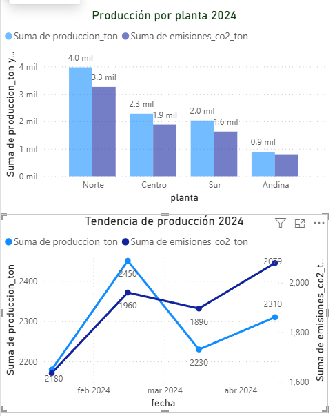

# Dashboard ESG: Análisis de Eficiencia Operativa

## Herramientas
PostgreSQL, Power BI

## Objetivo
Identificar pérdida de eficiencia en planta industrial comparando producción vs emisiones de CO2 durante 2024.

## Resultado clave
Se detectó aumento de 73% en intensidad de emisiones: de 0.75 a 1.30 ton CO2/ton producto. La planta emite más contaminando lo mismo mientras produce menos.

## Screenshot

## Cómo replicarlo
1. Script SQL en script_emisiones.sql
2. Abrir dashboard_esg.pbix en Power BI Desktop
